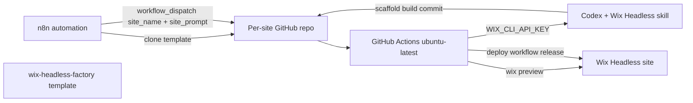

# wix-headless-factory

Reusable bootstrap template for spinning up **Wix Managed Headless** sites from automation (n8n, scripts, or manual `workflow_dispatch`).

Each cloned repo gets:

- **`AGENTS.md`** — Codex / agent rules with CI overrides for the [Wix Headless skill](https://www.wix-headless.dev/skill.md)
- **Bootstrap workflow** — runs Codex against the skill, scaffolds the project, builds, commits, publishes a Wix preview
- **Deploy workflow** — build + release on demand via GitHub-hosted runners

## Architecture



## Prerequisites

### GitHub secrets

| Secret | Purpose |
| --- | --- |
| `OPENAI_API_KEY` | Codex CLI via [openai/codex-action](https://github.com/openai/codex-action) |
| `WIX_CLI_API_KEY` | Wix CLI auth for scaffold, build, and release in CI |
| `GH_TOKEN` | PAT (or fine-grained token) with `contents` + `pull-requests` write — required for **Edit and preview** to open and merge PRs ([`GITHUB_TOKEN` cannot create PRs](https://docs.github.com/en/actions/security-for-github-actions/security-guides/automatic-token-authentication#permissions-for-the-github_token) in many repos) |
| `N8N_WEBHOOK_URL_TEST` | Optional — n8n Webhook trigger URL (test); workflows POST on completion |
| `N8N_WEBHOOK_URL_PROD` | Optional — n8n Webhook trigger URL (production); workflows POST on completion |
| `N8N_WEBHOOK_SECRET` | Optional — sent as `X-Webhook-Secret` for n8n auth |

### Wix API key

Generate a key in the [API Keys Manager](https://manage.wix.com/account/api-keys). Each job runs:

```bash
npx @wix/cli login --api-key "$WIX_CLI_API_KEY"
```

**Permissions:** start with **Wix CLI - Git Integration** (documented for [GitHub Actions + Wix CLI](https://dev.wix.com/docs/develop-websites/articles/workspace-tools/developer-tools/git-integration-wix-cli-for-sites/set-up-git-hub-actions-to-work-with-the-wix-cli-for-sites.md)). Full bootstrap also scaffolds new sites, installs apps, and seeds content — if those steps return `403`, add the relevant permissions (Stores, CMS, Blog, Forms, etc.) to the key.

Store the key as org or repo secret `WIX_CLI_API_KEY`. No self-hosted runner required.

## Workflows

### Bootstrap (`bootstrap.yml`)

**Trigger:** `workflow_dispatch`  
**Runner:** `ubuntu-latest`

| Input | Required | Description |
| --- | --- | --- |
| `site_name` | yes | Brand / display name (from n8n) |
| `site_prompt` | yes | Full site brief — Codex infers Stores/CMS/Blog/Forms from this |

**What it does:**

1. Authenticates Wix CLI with `WIX_CLI_API_KEY`
2. Installs the Wix Headless skill from `https://wix-headless.dev/skill.tgz`
3. Writes `.github/codex/.bootstrap-context.json` from inputs
4. Runs Codex (`openai/codex-action@v1`) with `AGENTS.md` + skill instructions
5. Commits generated project files and pushes (site always lives in `./site/`)
6. Builds and runs `scripts/preview-to-wix.sh` — preview URL and a plain-language **Your site** summary in the job summary, webhook (`userSummary`), and `.wix/run.json`

Production release is a separate step — run **Deploy** after approving the preview.

### Edit and preview (`edit-and-preview.yml`)

**Trigger:** `workflow_dispatch`  
**Runner:** `ubuntu-latest`

| Input | Required | Description |
| --- | --- | --- |
| `edit_prompt` | yes | Natural-language description of changes to make |
| `project_dir` | no | Wix project path (default `site`) |

**What it does:**

1. Runs Codex against the existing `./site/` project (no re-scaffold)
2. Commits **only staged** site changes, opens a PR with `GH_TOKEN`, then **merges to `main`**
3. Builds and runs [`wix preview`](https://dev.wix.com/docs/wix-cli/command-reference/project-commands/preview) — preview URL and a plain-language **What changed** summary in the job summary, webhook (`userSummary`), and `.wix/run.json`
4. Share the preview URL with the reviewer

### Deploy / release (`deploy.yml`)

**Trigger:** `workflow_dispatch` or reusable `workflow_call`  
**Runner:** `ubuntu-latest`

Run **after the reviewer approves the preview**. Builds and **releases to production** (`wix env pull` → `npx @wix/cli build` → `npx @wix/cli release`). Preview and release scripts pull `.env.local` from Wix in CI because it is not committed.

Default **`project_dir`** is `site`. Override only if you moved the project.

## n8n integration

Typical flow per new site:

1. **Create repo** — clone or generate from this template (GitHub “Use this template”, `gh repo create`, or n8n GitHub node).
2. **Configure secrets** — `OPENAI_API_KEY` and `WIX_CLI_API_KEY` on the new repo (or inherit from org).
3. **Dispatch bootstrap** — GitHub API:

```http
POST /repos/{owner}/{repo}/actions/workflows/bootstrap.yml/dispatches
Authorization: Bearer {github_pat}
Content-Type: application/json

{
  "ref": "main",
  "inputs": {
    "site_name": "Bloom & Root",
    "site_prompt": "Build a modern skincare ecommerce store with hero, about, and contact form. Warm minimal aesthetic, sell serums and moisturizers online."
  }
}
```

**n8n HTTP Request node settings:**

- Method: `POST`
- URL: `https://api.github.com/repos/{{owner}}/{{repo}}/actions/workflows/bootstrap.yml/dispatches`
- Headers: `Authorization: Bearer {{$credentials.githubToken}}`, `Accept: application/vnd.github+json`
- Body (JSON): map your site name and prompt fields to `inputs.site_name` and `inputs.site_prompt`

**On completion (recommended):** set `N8N_WEBHOOK_URL_TEST` and/or `N8N_WEBHOOK_URL_PROD` on the repo. Each workflow POSTs the same JSON payload to every configured URL (`bootstrap.completed`, `edit.completed`, or `deploy.completed`) with `jobResult`, `repoName`, `runUrl`, and `outcome.previewUrl` / `outcome.releaseUrl`. Failed deliveries retry up to 3 times with backoff. Use an n8n **Webhook** trigger instead of polling.

Poll run status (fallback):

```http
GET /repos/{owner}/{repo}/actions/runs?event=workflow_dispatch
```

After success, read URLs and `userSummary` from the webhook body, job summary, or `.wix/run.json` (`outcome.userSummary`).

See [`.factory/n8n-example.md`](.factory/n8n-example.md) for a step-by-step n8n checklist.

## Local development

```bash
# Authenticate (pick one)
export WIX_CLI_API_KEY="your-key"
bash scripts/verify-wix-auth.sh
# or: npx @wix/cli login

# Install skill only
bash scripts/install-wix-headless-skill.sh

# Prepare context (simulates workflow inputs)
SITE_NAME="Acme Coffee" \
SITE_PROMPT="Coffee roastery online store, sell beans and subscriptions" \
bash scripts/prepare-bootstrap-context.sh

# Generate Codex config (required before local Codex runs)
bash scripts/restore-codex-config.sh
```

Codex bootstrap is intended to run in CI; local runs need `OPENAI_API_KEY` and Wix CLI auth.

## Agent rules

Codex reads **`AGENTS.md`** at repo root. Key CI behaviors:

- No interactive Q&A — brand from `site_name`, verticals inferred from `site_prompt`
- Auto-approve discovery plan
- Wix CLI pre-authenticated via API key — no device login
- Full Wix Headless skill pipeline: Discovery → Setup → Seed → Orchestration → Build
- Wix API via `@wix/cli token` + `curl` (not MCP)

## File layout

```
.
├── AGENTS.md                          # Codex / Wix Headless CI rules
├── .github/
│   ├── workflows/
│   │   ├── bootstrap.yml              # n8n entry point — new site
│   │   ├── edit-and-preview.yml       # Codex edit → merge → wix preview
│   │   └── deploy.yml                 # Production release (after preview approval)
│   └── codex/
│       ├── config.toml.template       # Source of truth; CI generates config.toml
│       ├── factory.config.toml        # `--profile factory` overlay
│       └── prompts/
│           ├── bootstrap.md           # Bootstrap prompt template
│           └── edit.md                # Site edit prompt template
├── scripts/
│   ├── install-wix-headless-skill.sh
│   ├── prepare-bootstrap-context.sh
│   ├── verify-wix-auth.sh             # API key or existing session
│   ├── ensure-wix-env.sh              # wix env pull before build (CI)
│   ├── restore-codex-config.sh        # Generate config.toml from template
│   ├── commit-generated.sh
│   ├── stage-site-edits.sh
│   ├── commit-staged-edit-pr.sh
│   ├── prepare-edit-context.sh
│   ├── preview-to-wix.sh
│   ├── render-user-summary.sh         # Plain-language site summary for job summary + webhook
│   ├── notify-webhook.sh
│   └── release-to-wix.sh
├── .factory/                          # Automation metadata
├── site/                              # Wix Headless Astro project (created by bootstrap)
└── .wix/                              # Created during bootstrap
```

## References

- [Wix Headless Skill](https://www.wix-headless.dev/skill.md)
- [Wix CLI login (--api-key)](https://dev.wix.com/docs/wix-cli/command-reference/global-commands/login.md)
- [Codex GitHub Action](https://developers.openai.com/codex/github-action)
- [Wix Headless docs](https://dev.wix.com/docs/go-headless)
